# LiDAR Simulation Crop: Demonstration Report

## Overview

This report demonstrates the `LiDARSimulationCrop` transform, which provides physically realistic point cloud cropping that simulates actual LiDAR sensor limitations. Unlike arbitrary geometric cropping, this approach models real-world constraints including sensor range, field-of-view, and occlusion effects.

## Methodology

### Point Cloud Types

We tested three different synthetic point clouds to evaluate cropping behavior across various geometries:

1. **Cube**: 3000 points distributed on the surface of a 4×4×4 cube
2. **Sphere**: 2000 points with uniform volume distribution in a sphere (radius=2)
3. **Scene**: 4000 points representing a complex outdoor scene with ground plane, buildings, and objects

### Sensor Poses

Four different sensor configurations were tested to demonstrate pose-dependent cropping:

- **Origin Forward**: Sensor at (0,0,0) looking down +X axis
- **Elevated Down**: Sensor at (0,0,8) looking downward (-Z direction)
- **Side View**: Sensor at (8,0,2) looking toward -X direction
- **Angled View**: Sensor at (5,5,3) rotated 45° toward origin

### LiDAR Configurations

Five filtering configurations demonstrate individual and combined filter effects, ordered from single filters to combined approaches:

**Single Filter Types:**
1. **Range Only**: Distance filtering only (max_range=6m)
2. **FOV Only**: Field-of-view filtering isolated (120° horizontal, ±30° vertical, no range/occlusion limits)
3. **Occlusion Only**: Occlusion filtering isolated (no range/FOV limits, pure ray-casting effects)

**Mixed Filter Types:**
4. **Range + FOV**: Distance + field-of-view (120° horizontal, ±30° vertical, max_range=10m)

**Full Simulation:**
5. **Full Simulation**: Range + FOV + occlusion (90° horizontal, ±20° vertical, max_range=8m)

### Visualization Format

Each configuration shows a 2×2 grid with all four sensor poses in a single plot. Points are color-coded:
- **Blue**: Removed points (filtered out)
- **Red**: Kept points (passed through filter)
- **Black**: Sensor position with green orientation arrow
- **Purple wireframe**: Range sphere (for range_only)
- **Orange lines**: FOV cone (for fov_only)

## Results

### Single Filter Analysis

#### Range Only Filtering

**Cube Point Cloud:**
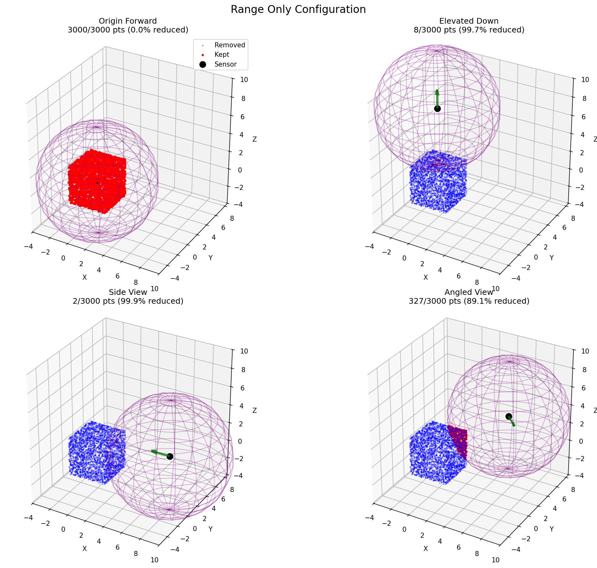
*Average reduction: 72.2% | Origin Forward: 0.0% | Elevated Down: 99.7% | Side View: 99.9% | Angled View: 89.1%*

**Sphere Point Cloud:**
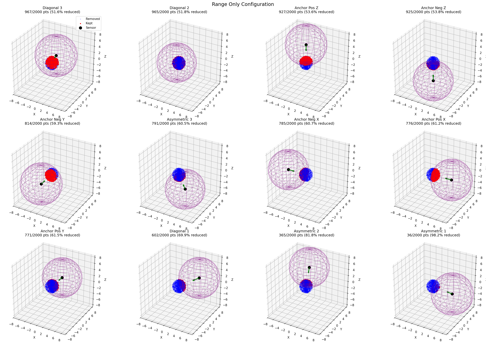
*Average reduction: 74.8% | Origin Forward: 0.0% | Elevated Down: 100.0% | Side View: 100.0% | Angled View: 99.1%*

**Scene Point Cloud:**
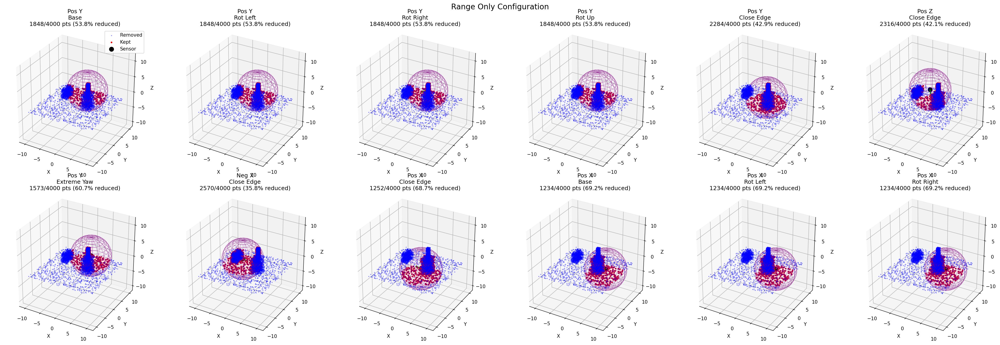
*Average reduction: 76.7% | Origin Forward: 57.0% | Elevated Down: 99.2% | Side View: 76.0% | Angled View: 74.4%*

#### FOV Only Filtering

**Cube Point Cloud:**
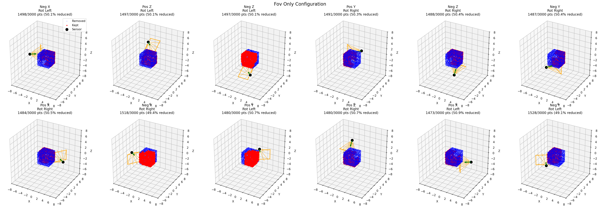
*Average reduction: 57.1% | Origin Forward: 84.0% | Elevated Down: 100.0% | Side View: 5.8% | Angled View: 38.5%*

**Sphere Point Cloud:**
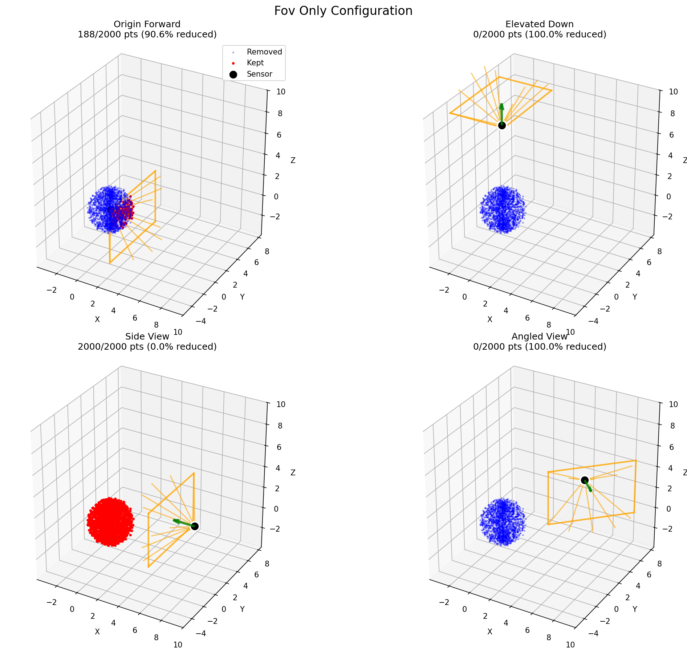
*Average reduction: 53.7% | Origin Forward: 90.6% | Elevated Down: 100.0% | Side View: 0.0% | Angled View: 24.1%*

**Scene Point Cloud:**
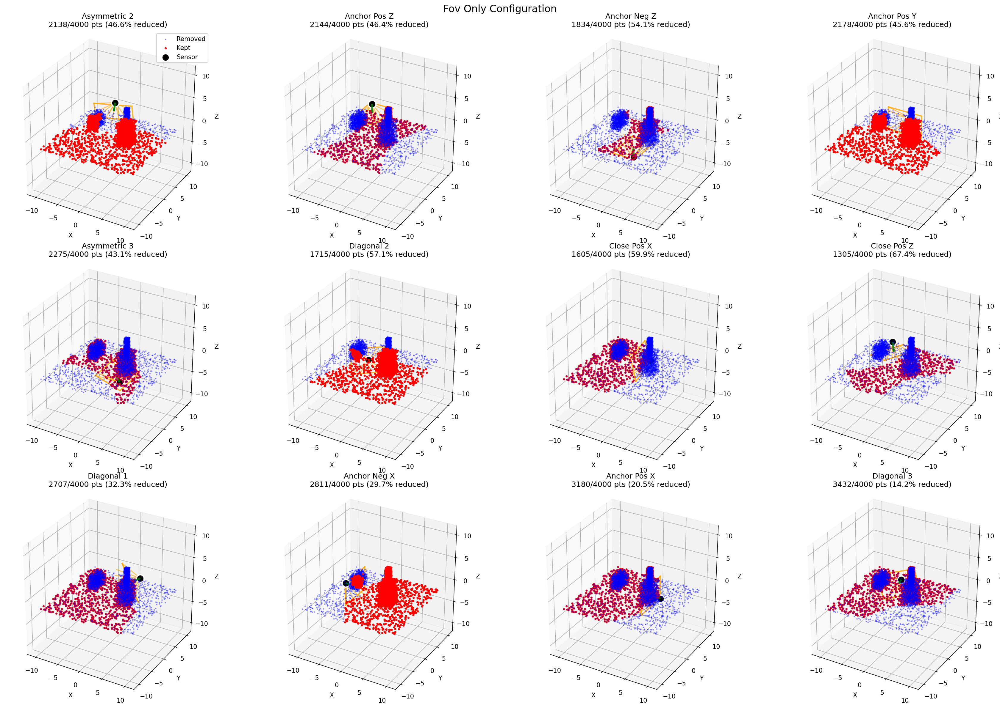
*Average reduction: 58.2% | Origin Forward: 72.7% | Elevated Down: 98.9% | Side View: 17.9% | Angled View: 43.4%*

#### Occlusion Only Filtering

**Cube Point Cloud:**
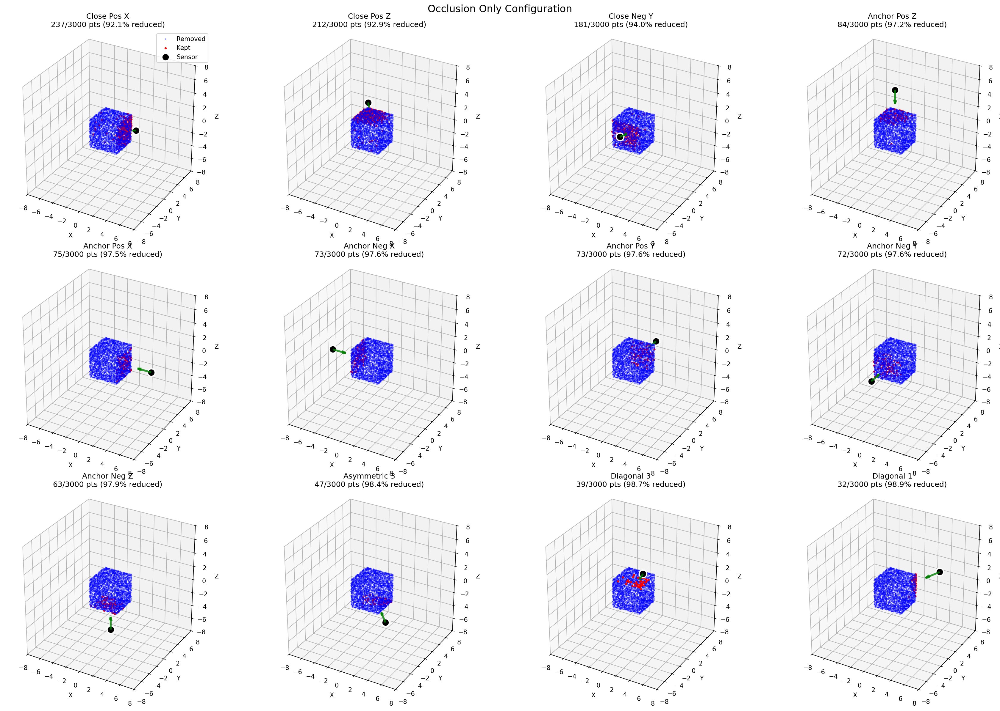
*Average reduction: 89.9% | Origin Forward: 61.0% | Elevated Down: 99.4% | Side View: 99.6% | Angled View: 99.8%*

**Sphere Point Cloud:**
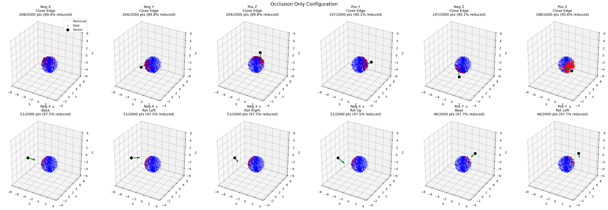
*Average reduction: 86.3% | Origin Forward: 47.9% | Elevated Down: 99.5% | Side View: 99.2% | Angled View: 98.8%*

**Scene Point Cloud:**
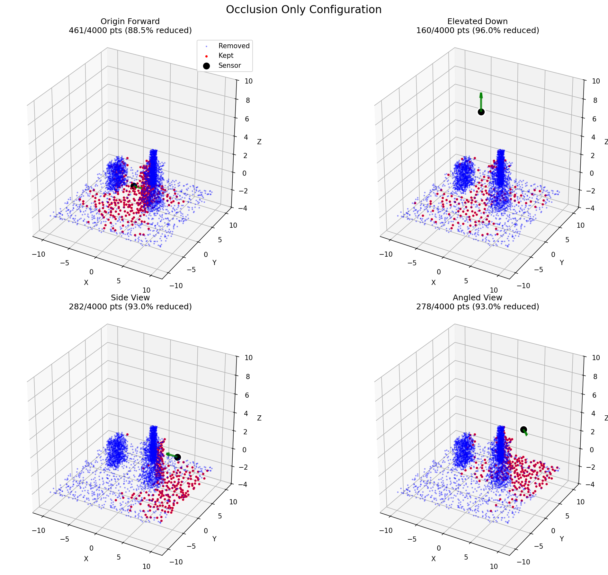
*Average reduction: 92.6% | Origin Forward: 88.5% | Elevated Down: 96.0% | Side View: 93.0% | Angled View: 93.0%*

### Mixed Filter Analysis

#### Range + FOV Filtering

**Cube Point Cloud:**
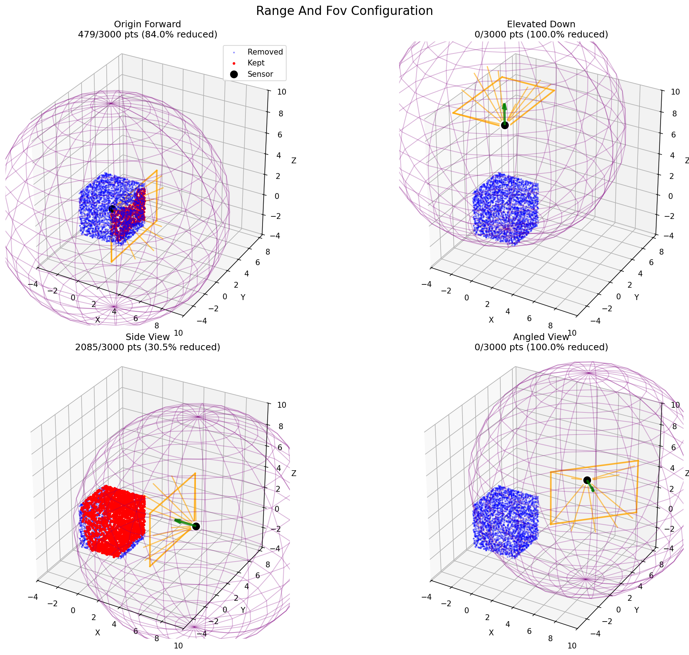
*Average reduction: 63.7% | Origin Forward: 84.0% | Elevated Down: 100.0% | Side View: 30.2% | Angled View: 40.6%*

**Sphere Point Cloud:**
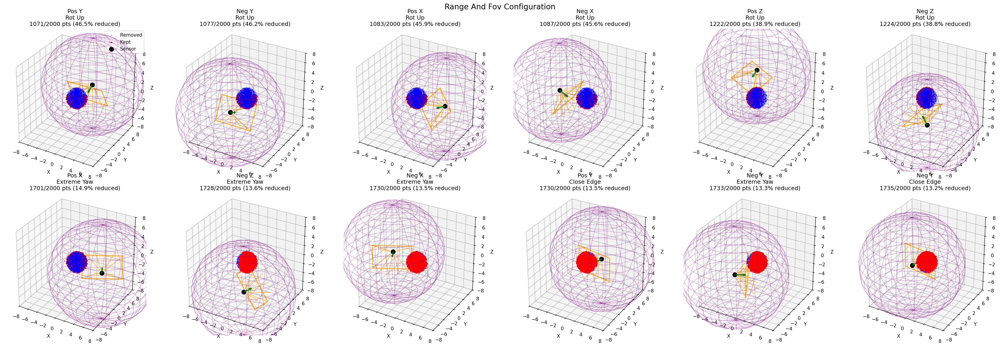
*Average reduction: 54.0% | Origin Forward: 90.6% | Elevated Down: 100.0% | Side View: 1.1% | Angled View: 24.1%*

**Scene Point Cloud:**

*Average reduction: 75.5% | Origin Forward: 75.3% | Elevated Down: 100.0% | Side View: 79.7% | Angled View: 47.0%*

### Full Simulation Analysis

#### Full Simulation (Range + FOV + Occlusion)

**Cube Point Cloud:**
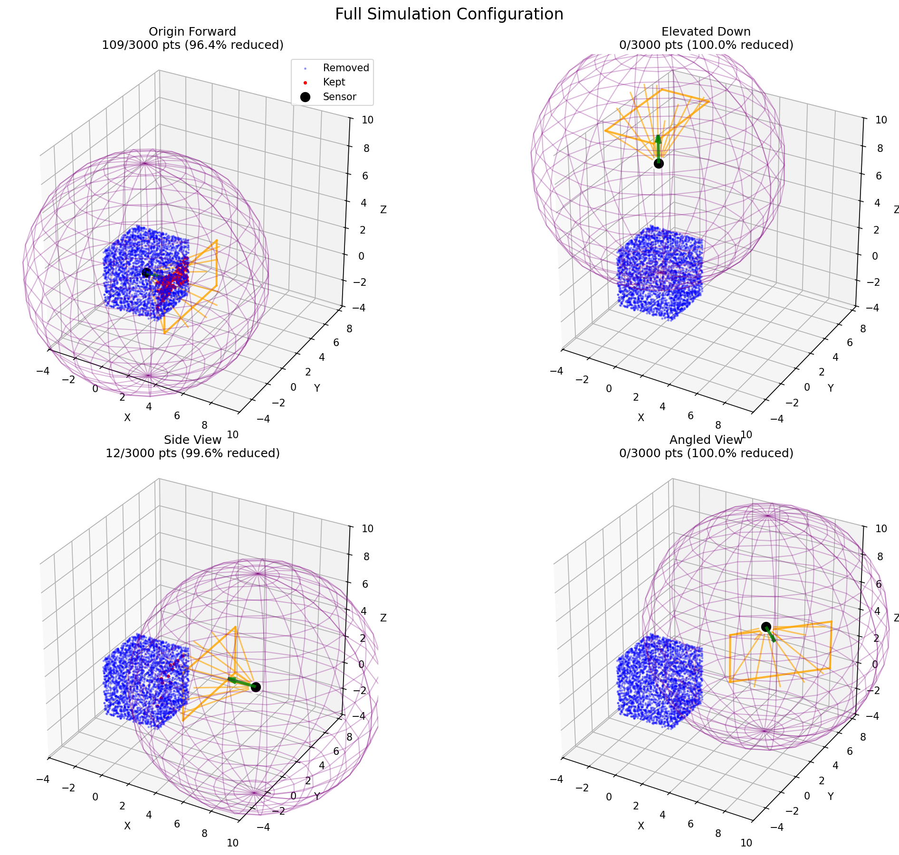
*Average reduction: 99.0% | Origin Forward: 96.4% | Elevated Down: 100.0% | Side View: 99.7% | Angled View: 99.9%*

**Sphere Point Cloud:**
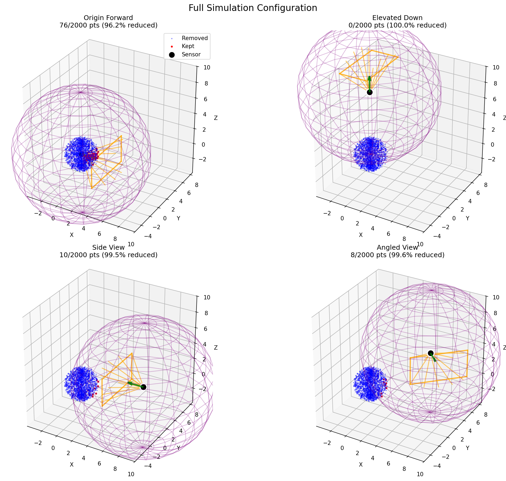
*Average reduction: 98.8% | Origin Forward: 96.2% | Elevated Down: 100.0% | Side View: 99.5% | Angled View: 99.6%*

**Scene Point Cloud:**
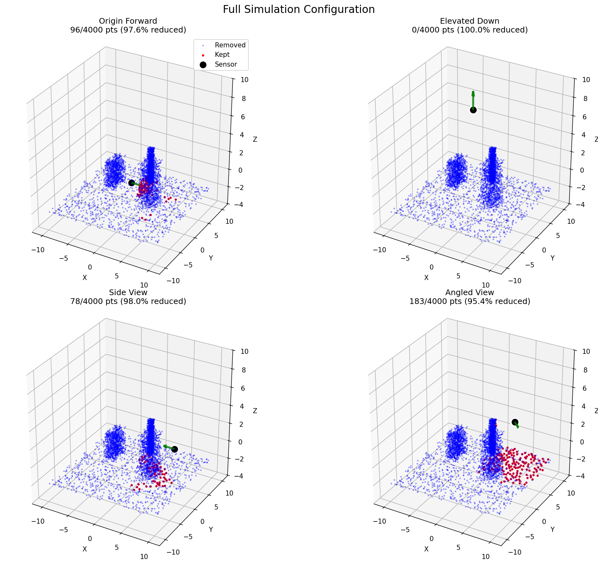
*Average reduction: 97.8% | Origin Forward: 97.6% | Elevated Down: 100.0% | Side View: 98.0% | Angled View: 95.4%*

## Analysis

### Key Observations

1. **Single Filter Characteristics**:
   - **Range filtering**: Highly pose-dependent, with sensors close to point clouds showing minimal filtering (0% at origin) while distant sensors show near-complete filtering (99%+)
   - **FOV filtering**: Creates directional sampling patterns with strong orientation dependence. Side views often show minimal reduction (0-17.9%) when geometry aligns with sensor direction
   - **Occlusion filtering**: Provides consistent high reduction (86.3-92.6% average) across all geometries, demonstrating realistic surface visibility constraints

2. **Filter Progression Effects**:
   - **Single filters** show distinct characteristics: range (distance-based), FOV (directional), occlusion (visibility-based)
   - **Mixed filters** (range + FOV) show intermediate reduction levels (54.0-75.5% average)
   - **Full simulation** produces very sparse but realistic point clouds (97.8-99.0% average reduction)

3. **Geometry-Specific Behavior**:
   - **Cube**: Sharp geometric boundaries create clear filter transitions
   - **Sphere**: Smooth surfaces demonstrate gradual filter effects  
   - **Scene**: Complex multi-object structure shows realistic urban scanning patterns

4. **Pose Sensitivity Patterns**:
   - **Origin Forward**: Shows geometry-dependent filtering based on structure alignment
   - **Elevated Down**: Consistently high reduction due to distance/FOV constraints
   - **Side View**: Often provides best coverage for elongated structures
   - **Angled View**: Balances distance, orientation, and visibility constraints

### Filter Interaction Analysis

**Individual vs Combined Effects:**
- Single filters provide clear isolation of specific sensing limitations
- Combined filters interact multiplicatively, not additively
- FOV-only demonstrates pure directional sampling without range constraints
- Occlusion-only reveals fundamental visibility patterns independent of sensor specs
- Full simulation produces realistic sparse sampling suitable for synthetic-to-real domain transfer

**Visual Verification Features:**
- **Range visualization**: Purple wireframe spheres confirm distance-based filtering boundaries
- **FOV visualization**: Orange cone outlines verify field-of-view constraints
- **Color coding**: Blue (removed) vs red (kept) points clearly show filter effects
- **Pose indicators**: Black sensors with green orientation arrows clarify viewing direction

## Practical Implications

### Research Applications

1. **Synthetic Data Generation**: Enables realistic LiDAR simulation for training robust point cloud registration models
2. **Domain Transfer**: Better synthetic-to-real generalization through physically accurate sensor modeling
3. **Algorithm Testing**: Systematic evaluation of registration algorithms under various sensor constraints
4. **Parameter Tuning**: Visual verification of filter effects enables optimal sensor configuration selection

### Technical Advantages

1. **Physically Realistic**: Models actual sensor limitations rather than arbitrary geometric cuts
2. **Controllable Parameters**: Adjustable range, FOV, and occlusion settings for different LiDAR types
3. **Deterministic Output**: Seeded generation ensures reproducible experimental results
4. **Modular Design**: Individual filter components enable targeted analysis and ablation studies

## Conclusion

The reorganized `LiDARSimulationCrop` demonstration successfully illustrates the progression from single-filter effects through mixed filters to full simulation. The new visualization format with 2×2 grids and blue/red color coding provides clear insights into how each filter type affects different geometries and sensor poses.

### Key Findings

1. **Filter Progression**: The ordered analysis (single → mixed → full) clearly shows how individual constraints combine to create realistic sensor limitations

2. **Visual Verification**: Range spheres and FOV cones enable direct validation of filter parameters against expected geometric constraints

3. **Pose-Dependent Behavior**: The 2×2 grid format effectively demonstrates how sensor positioning dramatically affects filtering results across all configurations

4. **Reproducible Results**: Seeded point cloud generation ensures consistent visualizations for reliable experimental validation

5. **Practical Implementation**: The modular filter design enables researchers to customize sensor simulation for specific LiDAR types and experimental requirements

The enhanced demonstration provides a comprehensive foundation for understanding and applying realistic LiDAR simulation in point cloud registration research, with clear visual validation of each filter component's contribution to the final sensor model.