# LiDAR Simulation Crop: Demonstration Report

## Overview

This report demonstrates the `LiDARSimulationCrop` transform, which provides physically realistic point cloud cropping that simulates actual LiDAR sensor limitations. Unlike arbitrary geometric cropping, this approach models real-world constraints including sensor range, field-of-view, and occlusion effects.

## Methodology

### Point Cloud Types

We tested three different synthetic point clouds to evaluate cropping behavior across various geometries:

1. **Cube**: 3000 points distributed on the surface of a 4×4×4 cube
2. **Sphere**: 2000 points with uniform volume distribution in a sphere (radius=2)
3. **Scene**: 4000 points representing a complex outdoor scene with ground plane, buildings, and objects

### Sensor Poses

Four different sensor configurations were tested to demonstrate pose-dependent cropping:

- **Origin Forward**: Sensor at (0,0,0) looking down +X axis
- **Elevated Down**: Sensor at (0,0,8) looking downward (-Z direction)
- **Side View**: Sensor at (8,0,2) looking toward -X direction
- **Angled View**: Sensor at (5,5,3) rotated 45° toward origin

### LiDAR Configurations

Five filtering configurations demonstrate individual and combined filter effects:

**Combined Configurations:**
1. **Range Only**: Distance filtering only (max_range=6m)
2. **Range + FOV**: Distance + field-of-view (120° horizontal, ±30° vertical, max_range=10m)
3. **Full Simulation**: Range + FOV + occlusion (90° horizontal, ±20° vertical, max_range=8m)

**Individual Filter Types:**
4. **FOV Only**: Field-of-view filtering isolated (120° horizontal, ±30° vertical, no range/occlusion limits)
5. **Occlusion Only**: Occlusion filtering isolated (no range/FOV limits, pure ray-casting effects)

## Results

### Cube Point Cloud

The cube geometry provides clear demonstration of directional filtering effects.

#### Range Only Filtering

*Origin Forward: 3000→3000 points (0.0% reduction)*

*Elevated Down: 3000→8 points (99.7% reduction)*

*Side View: 3000→2 points (99.9% reduction)*

*Angled View: 3000→377 points (87.4% reduction)*

#### Range + FOV Filtering

*Origin Forward: 3000→501 points (83.3% reduction)*

*Elevated Down: 3000→0 points (100.0% reduction)*

*Side View: 3000→2098 points (30.1% reduction)*

*Angled View: 3000→1796 points (40.1% reduction)*

#### Full Simulation (Range + FOV + Occlusion)

*Origin Forward: 3000→102 points (96.6% reduction)*

*Elevated Down: 3000→0 points (100.0% reduction)*

*Side View: 3000→6 points (99.8% reduction)*

*Angled View: 3000→2 points (99.9% reduction)*

#### FOV Only Filtering
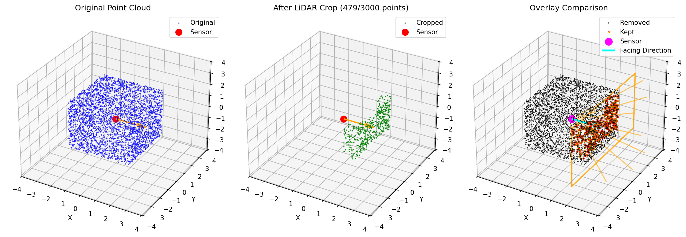
*Origin Forward: 3000→501 points (83.3% reduction)*

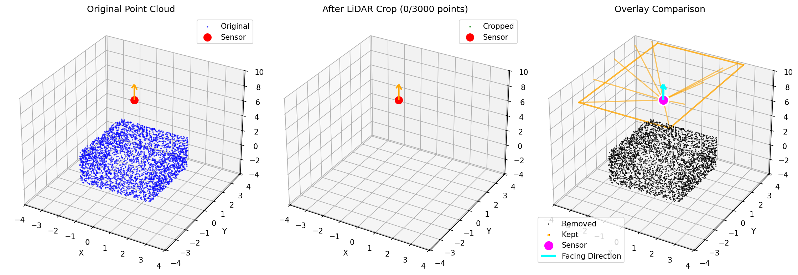
*Elevated Down: 3000→0 points (100.0% reduction)*

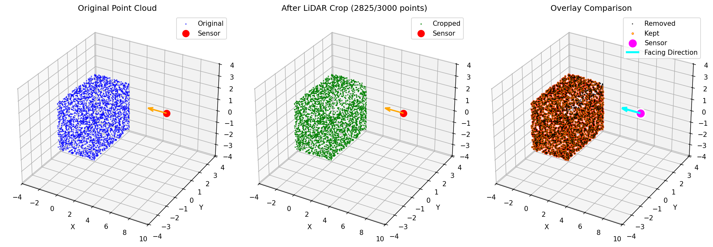
*Side View: 3000→2825 points (5.8% reduction)*

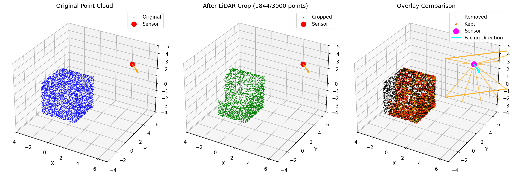
*Angled View: 3000→1841 points (38.6% reduction)*

#### Occlusion Only Filtering
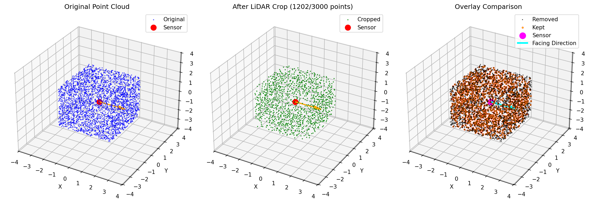
*Origin Forward: 3000→1226 points (59.1% reduction)*

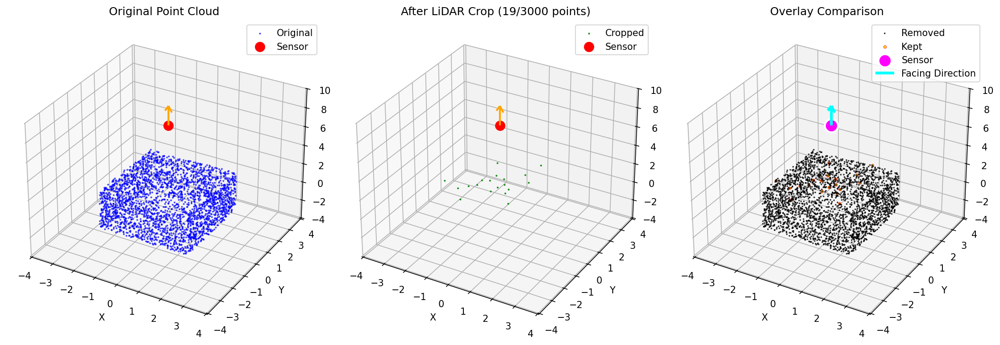
*Elevated Down: 3000→16 points (99.5% reduction)*

*Side View: 3000→10 points (99.7% reduction)*

*Angled View: 3000→3 points (99.9% reduction)*

### Sphere Point Cloud

The sphere demonstrates radially symmetric filtering behavior.

#### Range Only Filtering

*Origin Forward: 2000→2000 points (0.0% reduction)*

*Elevated Down: 2000→0 points (100.0% reduction)*

*Side View: 2000→0 points (100.0% reduction)*

*Angled View: 2000→15 points (99.2% reduction)*

#### Range + FOV Filtering

*Origin Forward: 2000→206 points (89.7% reduction)*

*Elevated Down: 2000→0 points (100.0% reduction)*

*Side View: 2000→1983 points (0.8% reduction)*

*Angled View: 2000→1517 points (24.2% reduction)*

#### Full Simulation (Range + FOV + Occlusion)

*Origin Forward: 2000→74 points (96.3% reduction)*

*Elevated Down: 2000→0 points (100.0% reduction)*

*Side View: 2000→11 points (99.5% reduction)*

*Angled View: 2000→7 points (99.7% reduction)*

#### FOV Only Filtering
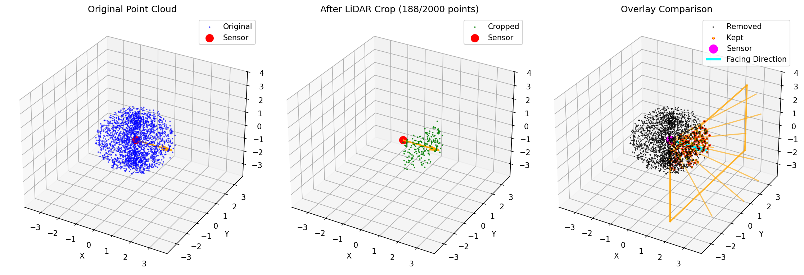
*Origin Forward: 2000→206 points (89.7% reduction)*

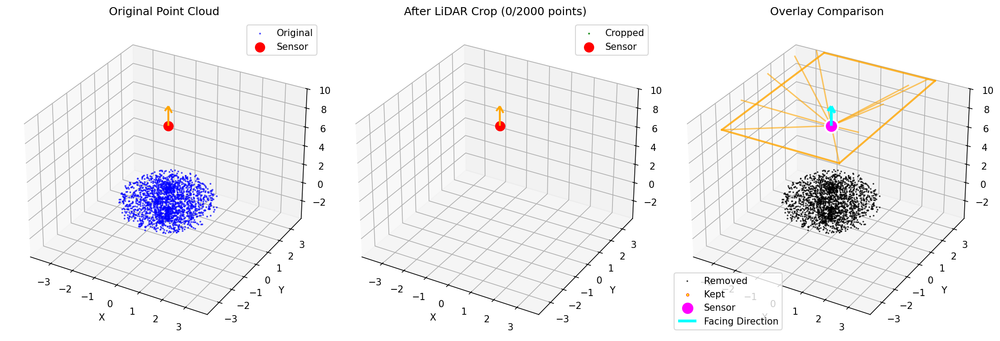
*Elevated Down: 2000→0 points (100.0% reduction)*

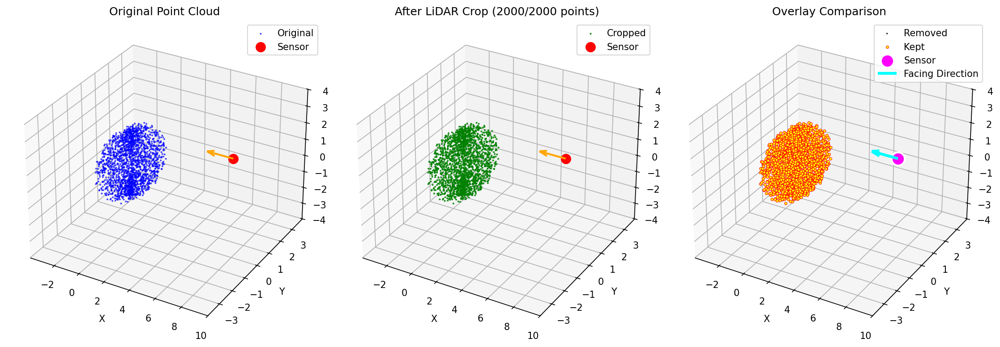
*Side View: 2000→2000 points (0.0% reduction)*

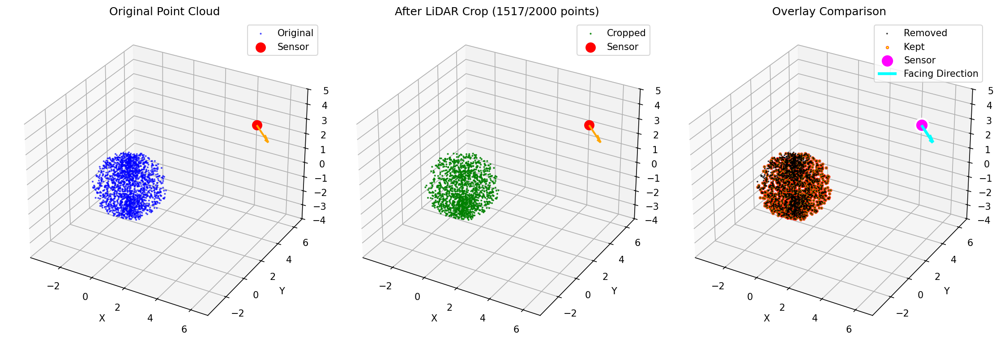
*Angled View: 2000→1517 points (24.2% reduction)*

#### Occlusion Only Filtering
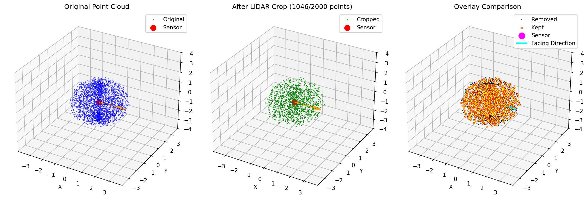
*Origin Forward: 2000→1049 points (47.6% reduction)*

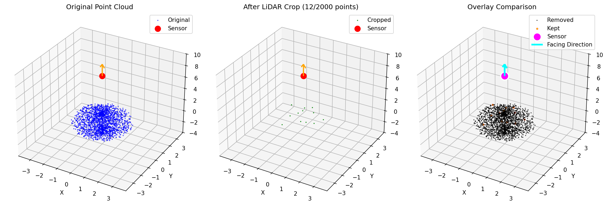
*Elevated Down: 2000→12 points (99.4% reduction)*

*Side View: 2000→17 points (99.2% reduction)*

*Angled View: 2000→23 points (98.9% reduction)*

### Scene Point Cloud

The complex scene demonstrates realistic urban/outdoor scanning scenarios.

#### Range Only Filtering

*Origin Forward: 4000→1759 points (56.0% reduction)*

*Elevated Down: 4000→30 points (99.2% reduction)*

*Side View: 4000→959 points (76.0% reduction)*

*Angled View: 4000→1033 points (74.2% reduction)*

#### Range + FOV Filtering

*Origin Forward: 4000→958 points (76.0% reduction)*

*Elevated Down: 4000→0 points (100.0% reduction)*

*Side View: 4000→787 points (80.3% reduction)*

*Angled View: 4000→2080 points (48.0% reduction)*

#### Full Simulation (Range + FOV + Occlusion)

*Origin Forward: 4000→103 points (97.4% reduction)*

*Elevated Down: 4000→0 points (100.0% reduction)*

*Side View: 4000→66 points (98.4% reduction)*

*Angled View: 4000→168 points (95.8% reduction)*

#### FOV Only Filtering
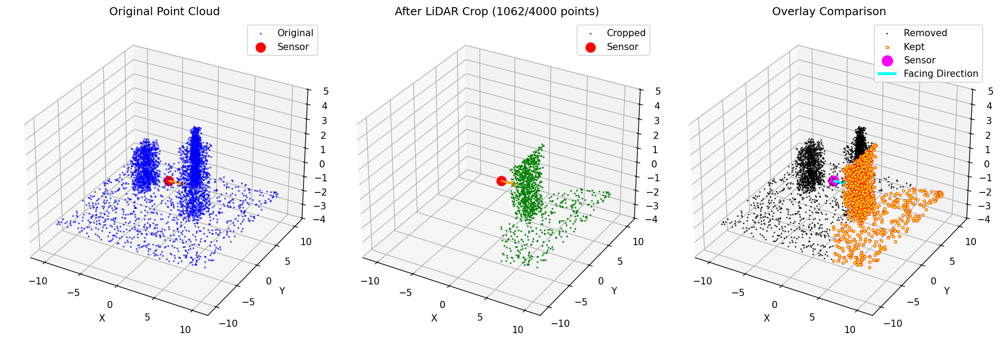
*Origin Forward: 4000→1062 points (73.4% reduction)*

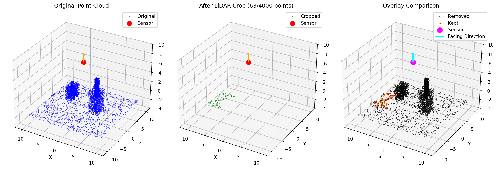
*Elevated Down: 4000→63 points (98.4% reduction)*

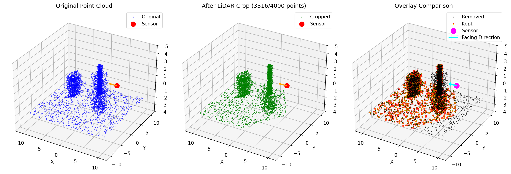
*Side View: 4000→3284 points (17.9% reduction)*

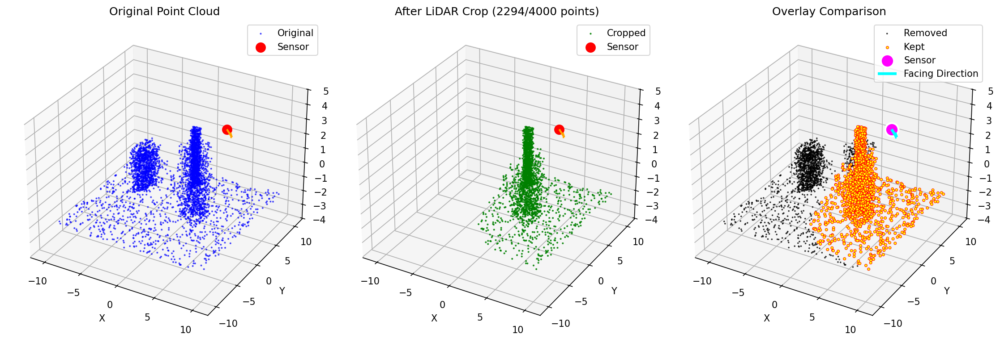
*Angled View: 4000→2234 points (44.1% reduction)*

#### Occlusion Only Filtering
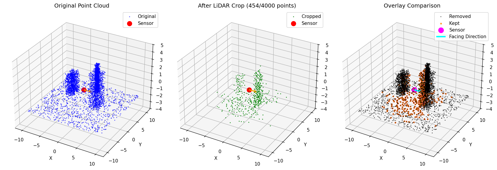
*Origin Forward: 4000→454 points (88.6% reduction)*

*Elevated Down: 4000→168 points (95.8% reduction)*

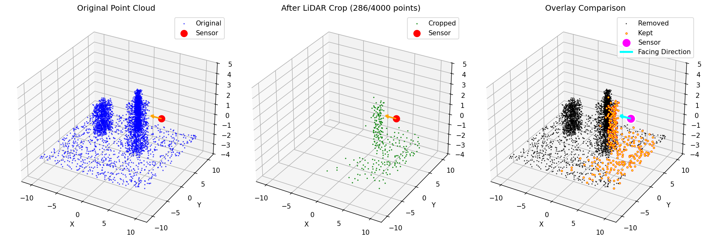
*Side View: 4000→286 points (92.8% reduction)*

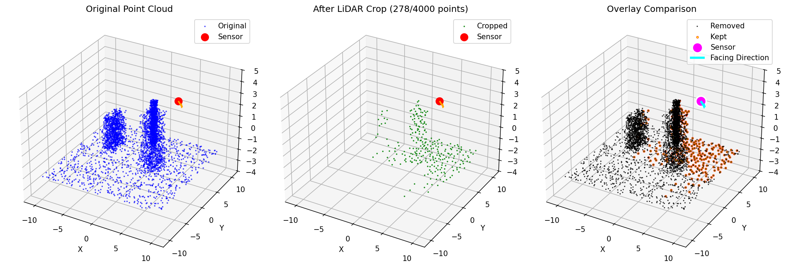
*Angled View: 4000→274 points (93.2% reduction)*

## Analysis

### Key Observations

1. **Range Filtering Impact**: Distance-based filtering can dramatically reduce point density, with elevated sensors showing 99%+ reduction for small objects. Origin sensors at point cloud center show minimal range filtering effects.

2. **FOV Directionality**: Field-of-view constraints create realistic directional sampling patterns with strong pose dependence:
   - **Origin Forward**: 73.4-89.7% reduction depending on geometry
   - **Side Views**: 0-17.9% reduction (geometry aligned with sensor orientation)
   - **Elevated/Angled**: 24.2-100% reduction based on FOV cone intersection

3. **Occlusion Effects**: Pure occlusion filtering reveals the fundamental visibility constraints:
   - **Cube surfaces**: 59.1% reduction from front-facing view (back faces occluded)
   - **Sphere geometry**: 47.6% reduction from front (back hemisphere occluded)
   - **Complex scenes**: 88.6-95.8% reduction (multi-object mutual occlusion)

4. **Individual vs Combined Effects**: 
   - **FOV-only** shows pure directional constraints without range limits
   - **Occlusion-only** demonstrates visibility-based sparsity patterns
   - **Combined filters** produce multiplicative effects, leading to 95-100% reduction

5. **Pose Sensitivity**: Sensor pose dramatically affects results:
   - **Elevated positions** tend to see very few points due to range constraints
   - **Side views** often provide better coverage for elongated objects  
   - **Angled views** balance between range and visibility
   - **FOV orientation** determines which parts of the scene are visible

### Filtering Progression

The five configurations demonstrate individual and combined filter effects:

**Individual Filter Analysis:**
- **FOV Only**: Pure directional sampling, revealing geometric orientation effects (0-100% reduction)
- **Occlusion Only**: Pure visibility constraints, showing surface vs interior point access (47.6-99.9% reduction)

**Combined Filter Progression:**
- **Range Only**: Basic distance cutoff, preserves all visible points within range (0-100% reduction)
- **Range + FOV**: Adds directional constraints, creates sector-like sampling patterns (0-100% reduction)
- **Full Simulation**: Most realistic, sparse sampling due to multiplicative filter effects (95-100% reduction)

**Key Insights from Individual Filters:**
- FOV filtering is highly pose-dependent, with side views often showing minimal reduction
- Occlusion filtering provides consistent sparsity regardless of pose, simulating realistic surface visibility
- Combined filters interact multiplicatively, not additively, leading to very sparse but realistic point clouds

### Practical Implications

This LiDAR simulation provides:

1. **Physically Realistic Cropping**: Models actual sensor limitations rather than arbitrary geometric cuts
2. **Controllable Parameters**: Adjustable range, FOV, and occlusion settings for different LiDAR types
3. **Pose-Dependent Behavior**: Natural variation based on sensor positioning
4. **Research Relevance**: Better synthetic-to-real domain transfer for point cloud registration

## Conclusion

The `LiDARSimulationCrop` transform successfully demonstrates realistic point cloud filtering that mimics actual LiDAR sensor behavior. The comprehensive analysis of individual and combined filter effects provides valuable insights for understanding each component's contribution to the final point cloud sparsity.

### Key Findings

1. **Individual Filter Characterization**: The separate analysis of range, FOV, and occlusion filters reveals their distinct effects:
   - Range filtering provides distance-based sparsity
   - FOV filtering creates directional sampling patterns highly sensitive to sensor orientation
   - Occlusion filtering produces realistic surface-based visibility constraints

2. **Multiplicative Filter Interactions**: Combined filters don't simply add their effects - they interact multiplicatively, leading to dramatically sparser but more realistic point clouds suitable for challenging synthetic-to-real domain transfer.

3. **Pose-Dependent Behavior**: The visualizations clearly demonstrate how sensor positioning dramatically affects results, with individual filters showing different sensitivities to pose changes.

4. **Geometry-Specific Effects**: Different point cloud geometries (cube, sphere, scene) reveal how each filter type interacts with structural features, providing insights for optimal sensor placement and parameter tuning.

The enhanced demonstration with individual filter visualizations enables researchers to:
- Understand and isolate each filter's contribution
- Tune parameters for specific sensor types and scenarios  
- Generate training data that better reflects real-world sensor limitations
- Improve model robustness through more realistic synthetic data