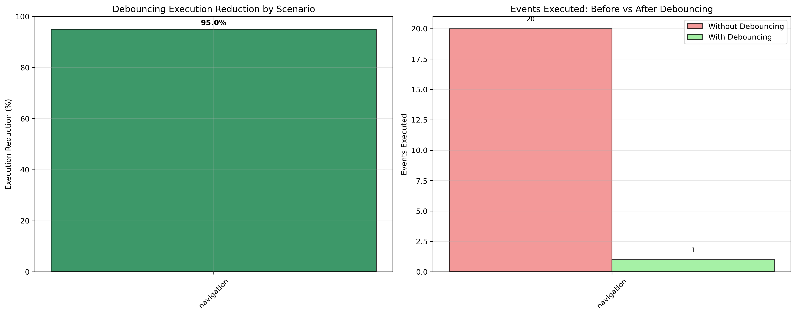
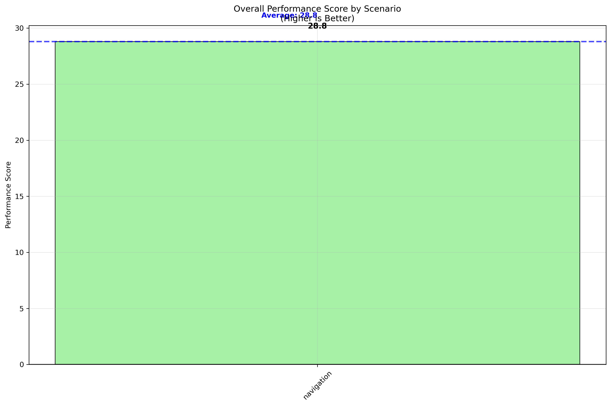
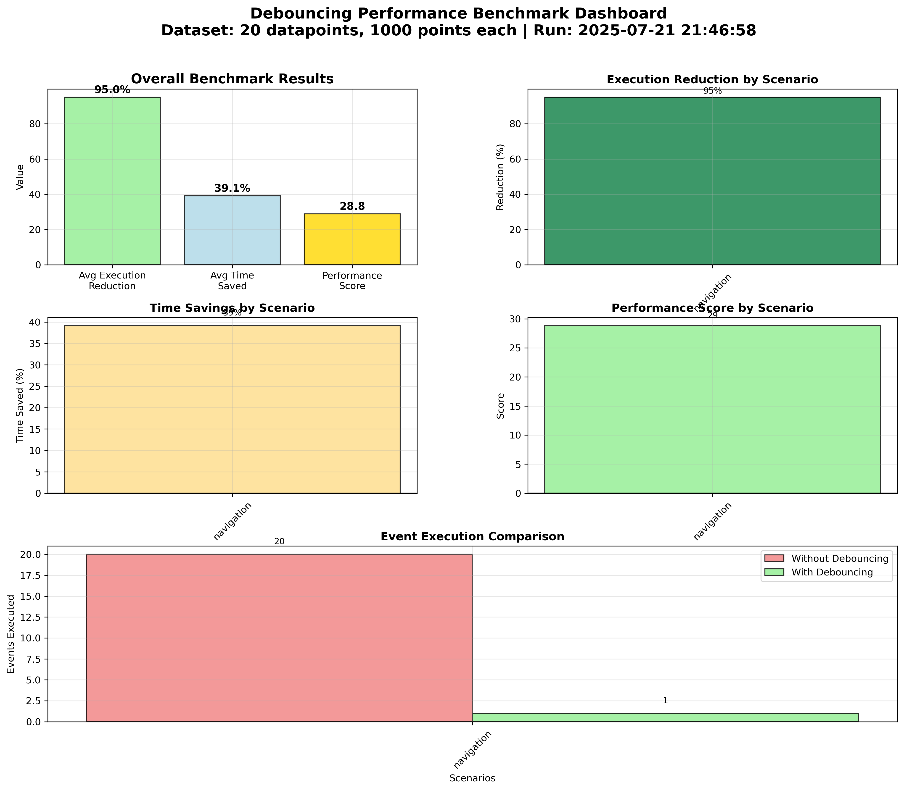

# Debouncing Benchmark Report

## Configuration

- **Dataset**: 20 datapoints, 1000 points each
- **Scenarios**: navigation
- **Run Date**: 2025-07-21 21:46:58

## Overall Performance

- **Average Execution Reduction**: 95.0%
- **Average Time Saved**: 39.1%
- **Overall Performance Score**: 28.8

### Interpretation

**✅ **GOOD** - Debouncing provides moderate benefits**

**Recommendation**: Recommend keeping debouncing enabled

## Scenario Results

| Scenario | Exec Reduction | Time Saved | Score | Impact |
|----------|----------------|------------|-------|--------|
| navigation | 95.0% | 39.1% | 28.8 | ⚡ Medium |

## Key Insights

- **Best performing scenario**: `navigation` (score: 28.8)
- **Worst performing scenario**: `navigation` (score: 28.8)
- **Highest execution reduction**: `navigation` (95.0%)
- **Highest time savings**: `navigation` (39.1%)

## Visualizations

### Per-Callback Performance Analysis


### Execution Reduction by Scenario



### Performance Scores by Scenario



### Comprehensive Performance Dashboard



### Time Savings Analysis


## Performance Score Explanation

The Performance Score is a composite metric calculated as:

```
performance_score = (execution_reduction_% + time_saved_% + cpu_reduction_%) / 3
```

### Score Interpretation

| Score Range | Interpretation | Meaning |
|-------------|----------------|----------|
| 50+ | 🎉 Excellent | Debouncing provides significant benefits |
| 20-50 | ✅ Good | Debouncing provides moderate benefits |
| 0-20 | ⚠️ Marginal | Debouncing provides minimal benefits |
| Below 0 | ❌ Negative | Debouncing may be causing overhead |

## Raw Data

Complete benchmark results are available in [`debounce_benchmark_full.json`](debounce_benchmark_full.json)

---
*Report generated automatically by the Pylon debouncing benchmark system*
