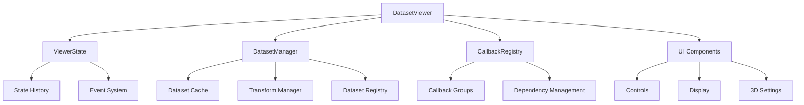
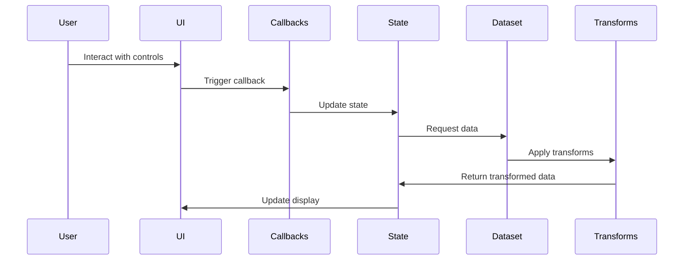
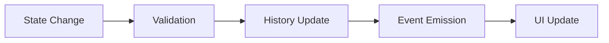
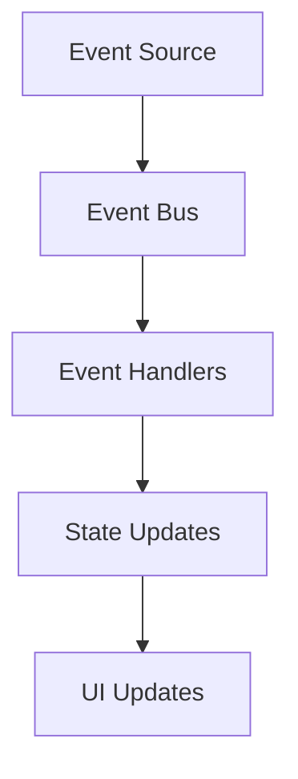

# Dataset Viewer Architecture

## Overview

The Dataset Viewer is built with a modular architecture that separates concerns into distinct components. This document describes the architecture in detail, including component interactions and data flow.

## Component Diagram

## Data Flow

## Component Details

### 1. DatasetViewer

The main application class that coordinates all components:

- Initializes and manages all subsystems
- Creates and configures the Dash application
- Handles high-level application flow
- Manages logging and configuration
- Provides CLI interface

### 2. ViewerState

Manages application state and history:

- Tracks current dataset, index, and settings
- Maintains undo/redo history
- Emits events for state changes
- Validates state updates
- Manages 3D visualization settings
- Handles transform state

### 3. DatasetManager

Handles dataset operations:

- Loads and caches datasets
- Manages dataset configurations
- Handles dataset transforms
- Provides dataset information
- Supports multiple dataset types:
  - 2D Change Detection
  - 3D Change Detection
  - Point Cloud Registration
  - Semantic Segmentation

### 4. TransformManager

Manages data transformations:

- Registers and manages transforms
- Applies transforms to datapoints
- Handles transform configurations
- Supports transform chaining
- Validates transform parameters

### 5. CallbackRegistry

Manages callback registration and dependencies:

- Provides decorator-based callback registration
- Groups related callbacks
- Manages callback dependencies
- Handles error reporting
- Supports callback chaining

### 6. UI Components

Modular components for the user interface:

- Controls:
  - Dataset selector
  - Navigation controls
  - Transform controls
  - 3D visualization settings
- Display components:
  - 2D image visualization
  - 3D point cloud visualization
  - Statistics display
  - Metadata display
- Layout management
- Responsive design

## State Management

The viewer uses a centralized state management system:

## Caching System

The dataset caching system implements:

- LRU (Least Recently Used) caching
- Memory usage limits
- Transform-aware caching
- Automatic cache cleanup
- Cache statistics tracking

## Event System

Events are used for component communication:

Event Types:
- DATASET_CHANGED
- INDEX_CHANGED
- TRANSFORMS_CHANGED
- SETTINGS_CHANGED
- STATE_CHANGED

## Error Handling

The viewer implements a comprehensive error handling system:

- Custom exceptions for different error types
- Logging at multiple levels
- User-friendly error messages
- Graceful degradation
- State recovery mechanisms

## Performance Considerations

The architecture includes several performance optimizations:

1. **Caching**
   - LRU cache with size limits
   - Memory-aware caching
   - Transform-aware caching
   - Cache statistics tracking

2. **Data Loading**
   - Efficient dataset loading
   - Transform caching
   - Memory usage monitoring
   - Resource cleanup

3. **UI Optimization**
   - Efficient rendering
   - Debounced updates
   - Responsive layout
   - 3D visualization optimization

## Security

The architecture includes security considerations:

1. **Input Validation**
   - All user inputs are validated
   - Dataset paths are sanitized
   - Transform parameters are checked
   - State updates are validated

2. **Resource Management**
   - Memory limits for caching
   - File handle management
   - Network request limits
   - Resource cleanup

## Testing

The architecture supports comprehensive testing:

1. **Unit Tests**
   - Component-level testing
   - State management testing
   - Cache system testing
   - Transform testing

2. **Integration Tests**
   - Component interaction testing
   - End-to-end testing
   - Performance testing
   - UI testing

## Future Considerations

The architecture is designed to be extensible:

1. **Dataset Support**
   - New dataset type integration
   - Custom dataset formats
   - Dataset preprocessing

2. **Visualization**
   - Custom visualization plugins
   - Advanced 3D features
   - Interactive analysis tools

3. **Integration**
   - External tool integration
   - API support
   - Batch processing
