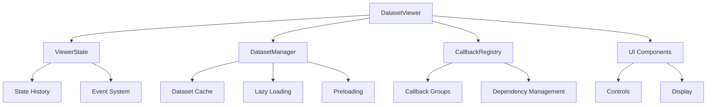
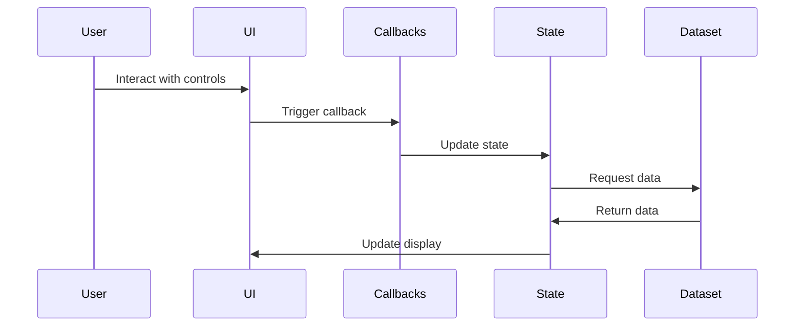
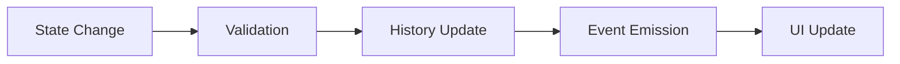
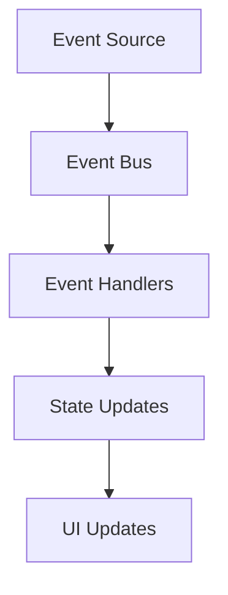

# Dataset Viewer Architecture

## Overview

The Dataset Viewer is built with a modular architecture that separates concerns into distinct components. This document describes the architecture in detail, including component interactions and data flow.

## Component Diagram

## Data Flow

## Component Details

### 1. DatasetViewer

The main application class that coordinates all components:

- Initializes and manages all subsystems
- Creates and configures the Dash application
- Handles high-level application flow

### 2. ViewerState

Manages application state and history:

- Tracks current dataset, index, and settings
- Maintains undo/redo history
- Emits events for state changes
- Validates state updates

### 3. DatasetManager

Handles dataset operations:

- Loads and caches datasets
- Implements lazy loading
- Manages preloading of adjacent items
- Handles dataset transforms

### 4. CallbackRegistry

Manages callback registration and dependencies:

- Provides decorator-based callback registration
- Groups related callbacks
- Manages callback dependencies
- Handles error reporting

### 5. UI Components

Modular components for the user interface:

- Controls (dataset selector, navigation, transforms)
- Display components (2D/3D visualization)
- Layout management
- Responsive design

## State Management

The viewer uses a centralized state management system:

## Caching System

The dataset caching system implements:

- LRU (Least Recently Used) caching
- Memory usage limits
- Thread-safe operations
- Automatic cache cleanup

## Event System

Events are used for component communication:

## Error Handling

The viewer implements a comprehensive error handling system:

- Custom exceptions for different error types
- Logging at multiple levels
- User-friendly error messages
- Graceful degradation

## Performance Considerations

The architecture includes several performance optimizations:

1. **Lazy Loading**
   - Datasets are loaded on demand
   - Items are cached for quick access
   - Memory usage is monitored and managed

2. **Preloading**
   - Adjacent items are preloaded
   - Background loading for smooth navigation
   - Configurable preload window

3. **Caching**
   - LRU cache with size limits
   - Memory-aware caching
   - Thread-safe operations

4. **UI Optimization**
   - Efficient rendering
   - Debounced updates
   - Virtual scrolling for large datasets

## Security

The architecture includes security considerations:

1. **Input Validation**
   - All user inputs are validated
   - Dataset paths are sanitized
   - Transform parameters are checked

2. **Resource Management**
   - Memory limits for caching
   - File handle management
   - Network request limits

## Testing

The architecture supports comprehensive testing:

1. **Unit Tests**
   - Component-level testing
   - State management testing
   - Cache system testing

2. **Integration Tests**
   - Component interaction testing
   - End-to-end testing
   - Performance testing

3. **UI Tests**
   - Component rendering tests
   - User interaction tests
   - Responsive design tests

## Future Considerations

The architecture is designed to be extensible:

1. **Plugin System**
   - Support for custom visualizations
   - Custom transform plugins
   - Dataset type extensions

2. **API Extensions**
   - REST API support
   - WebSocket integration
   - External tool integration

3. **UI Customization**
   - Theme support
   - Layout customization
   - Component replacement 